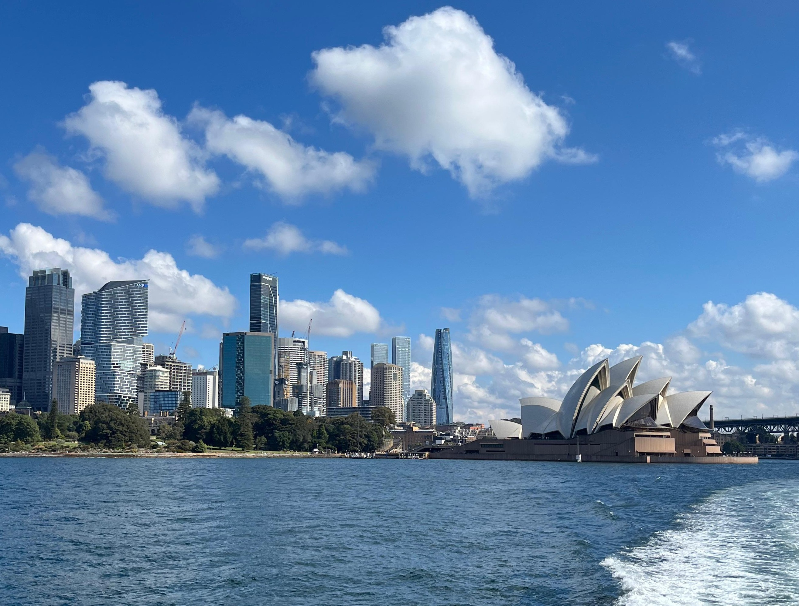
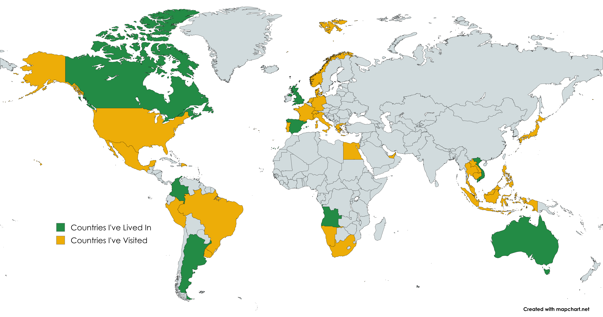
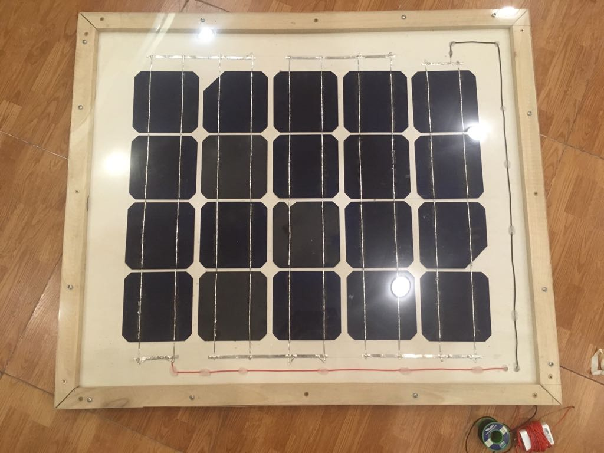

# About Felipe Diaz

*Condensed from the "About" page of felipediazv.com. Images referenced below live in `assets/` next to this file.*

**Tagline:** While my degree is in Integrated Engineering, what truly defines me is my upbringing, an innate curiosity, and a relentless drive for growth.

---

## A Global Childhood

Grew up moving countries roughly every three years, following my dad's work. It wasn't always easy, but each move built adaptability, pushed me out of my comfort zone, and exposed me to new cultures.

## Life Journey (Timeline)

A chronological path through the countries I've lived in, with the moments that mattered most in each:

- **Colombia, 2002–2005 (age 0–3)**
  - 2002 — Born in Colombia (`assets/dad_babyme.jpg`)
  - 2003 — Family (`assets/familia.jpg`)
- **Scotland, 2005–2008 (age 3–6)**
  - 2006 — First moved to Scotland (`assets/scotland_fam.jpg`)
  - 2006 — First school, started primary education (`assets/image_soon.png`)
  - 2007 — Discovered a passion for football (`assets/image_soon.png`)
- **Argentina, 2008–2011 (age 6–9)**
  - 2009 — *(entry coming soon)*
- **Spain, 2011–2012 (age 9)**
  - 2012 — *(entry coming soon)*
- **Angola, 2012–2015 (age 10–13)**
  - 2013 — Training at the Angolan Football Academy (`assets/afa.jpg`)
  - 2014 — *(entry coming soon)*
- **Vietnam, 2015–2018 (age 13–16)**
  - 2016 — International football tournament (`assets/MRISA_JR.jpeg`)
  - 2017 — Traveling South East Asia (`assets/image_soon.png`)
  - 2017 — STEM passion discovered — engineering intertwined with green energy (`assets/solarpanel_pp.jpeg`)
- **Colombia, 2018–2021 (age 16–18)**
  - March 2019 — *(entry coming soon)*
  - 2020 — High school graduation, completed during Covid (`assets/highschool_grad.jpg`)
  - 2020 — Started Engineering at UBC during Covid (`assets/ubc_eng_logo_red.jpg`)
- **Canada, 2021–2024.5 (age 19–22.5)**
  - Summer 2022 — A month in Paris studying French (`assets/summerfrance.jpg`)
  - 2023 — First co-op, internship in the construction industry (`assets/ledcor_pic.jpg`)
  - 2023–2024 — 8-month clean-tech start-up co-op (`assets/miru_curing.jpg`)
- **Australia, 2024.5–2025 (age 22.5–23)**
  - 2024 — Lived and studied in Australia (`assets/australia.jpg`)
- **Canada, 2025–present (age 23+)**
  - March 2025 — Returned to Canada for continued studies (`assets/headshot_felipe1.jpg`)

## What I Learned Along the Way

Constantly starting over — new friends, new routines — taught resilience and a growth mindset: the biggest challenges bring the most growth, and full commitment makes adaptation possible.

Living across so many cultures built global citizenship, empathy, and adaptability. New schools, teams, and communities forced social growth; sports and group activities built leadership and communication; travel broadened perspective and turned diversity into something to celebrate. Net result: resilience, adaptability, and a growth mindset carried into every challenge today.

## Curiosity, Technology and Futurism

Curiosity was first sparked by my grandfather, who ran science experiments every Christmas in Colombia and remains, alongside my father, one of my biggest role models.

My father worked in oil and gas — the reason for all the moving — yet he was also the one who told me renewable energy was the future and that oil and gas would eventually disappear. Coming of age as climate change became the defining global issue turned that early interest into a deeper fascination with clean technology and innovation broadly.

> "Explorer of the future, trying to imagine the possibilities that lie ahead." — Peter Schwartz

> "A person that has unbounded curiosity about what our future may hold." — Nikolas Badminton

Curiosity about emerging technology set the path; engineering became the tool to turn ideas into solutions. Solving the world's biggest problems takes more than engineering — it also takes understanding society, economics, and policy (see the Research page).

I consider myself a **futurist**: not just speculating about what's next, but exploring what's possible so we make better choices today — staying curious about the world at both the micro and macro scale, and believing technology and human creativity, paired with optimism and focus, can build a brighter future.

## Hobbies and Activities

Soccer, Backpacking, Gym, Running, Skiing, Snowboarding, Triathlon, Jet Skiing, Surfing, Volleyball, Tennis, Skydiving, Scuba Diving, Hiking, Wake Boarding, Quad Biking.

(Photos: `assets/Soccer.jpg`, `assets/backpacking.jpg`, `assets/gym.jpg`, `assets/running.jpg`, `assets/skiing.jpg`, `assets/snowboard.jpg`, `assets/triathlon.jpg`, `assets/jetskiing.jpg`, `assets/surfing.jpg`, `assets/volleyball.jpg`, `assets/tennis.jpg`, `assets/skydiving.jpg`, `assets/Scubadiving.JPG`, `assets/bluemountains.jpg`, `assets/wakeboarding.jpg`, `assets/quadbiking.jpg`)

## Books and Podcasts

A curated collection that's shaped my thinking as an engineer and futurist — 50+ books read, 200+ podcast hours.

Top picks:
- **The Laws of Human Nature** — Robert Greene (9/10) — `assets/laws_of_human_nature.jpg`
- **Modern Wisdom** (podcast) — Chris Williamson (10/10) — `assets/modernwisdom.jpeg`
- **The Almanac of Naval Ravikant** (10/10) — `assets/almanac_naval_ravikant.jpg`
