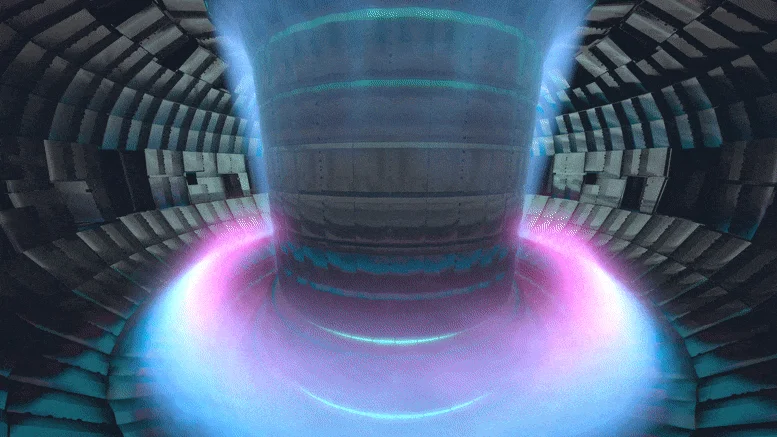

# The Energy Source that will Power the Future

**September 16, 2025** • 12 min read

Fusion energy has the potential to fix climate change and propel humanity into a new energy era, but it must overcome enormous challenges first.

**\* This blog post is a draft.**

Tags: ⚡ Energy · 🌱 Clean Tech · 🌍 Geopolitics · 📈 Investing

## Table of Contents

- [Introduction](#introduction)
- [Why Fusion Can Change the Path of Humanity](#why-fusion-can-change-the-path-of-humanity)
- [The Technical Barriers](#the-technical-barriers)
- [Approaches and Leading Players](#approaches-and-leading-players)
- [Who Is Investing and Why](#who-is-investing-and-why)
- [Looking Ahead](#looking-ahead)

## Introduction

Fusion – the reaction that powers the stars and the sun – has captured the public imagination for decades with the promise of abundant, clean, and virtually waste-free energy. Yet that promise remains unfulfilled, and commercialization is still a distant goal. Even so, the past five years have brought remarkable technical progress, supported by a surge of both public and private investment. If successful, the stakeholders will reap financial and political benefits, changing the energy landscape and potentially creating a new world order.

But while interest is at an all-time high and headlines continue to raise expectations, the challenges ahead are monumental. Around the world, efforts range from government-funded labs to venture-backed startups. Each is pursuing its own path to fusion, but all share the same fundamental technical obstacles that must be overcome.

*A tokamak fusion reactor represents humanity's most ambitious attempt to achieve controlled fusion energy.*

## Why Fusion Can Change the Path of Humanity

- **Clean, limitless and safe energy** - Unlike nuclear fission, fusion has no long-lived radioactive waste. It emits 0 carbon dioxide. The fuel used to power fusion is seawater, an abundant resource. A melt down is impossible as the reaction can only continue if sustained at insanely high temperatures and pressures.
- **Base Load Power** - Once operational, it will be constant, steady, always on power. It will fill the gap left by the fluctuation of other renewables. It would reduce the need for massive energy storage solutions.
- **Satisfy and exceed increasing energy demands** - Developing economies, electrification of transportation, and now the AI boom, the demand for energy will keep increasing at rates that aren't sustainable. If fusion becomes widely available, it will unlock the possibility to exploit new technologies to combat climate change: water desalination, synthesizing fuels for transportation, and carbon capture.
- **Energy Security** - Any nation with access to seawater can potentially reach energy independence. There is the possibility for the democratization of energy, equity in energy use and therefore worldwide economic development.
- **Geopolitical Leverage** – Oil and gas rich countries will no longer hold geopolitical leverage and conflicts could be reduced. Granted, the first country to commercialize fusion will have a significant geopolitical advantage that can be abused.

It's easy to daydream about an idealistic fusion-driven future, but it's important to remain realistic about the engineering challenges that must be solved before we claim victory or even plan for it.

## The Technical Barriers

All fusion reactors, regardless of methods, face the same grand challenges:

1. **Achieving Net Gain:** Above all, reactors must produce more energy than they consume to initiate and sustain the reaction. This requires meeting the Lawson Criterion, which sets the threshold for plasma density, temperature, and confinement time needed for a positive net gain (Q > 1).
2. **Sustaining Fusion Conditions:** To generate power sustainably, we must overcome plasma instabilities that disrupt confinement, develop materials that can withstand relentless heat and neutron bombardment, and establish a reliable and safe tritium breeding cycle to ensure continuous fuel supply.
3. **Energy Conversion and Scale-Up:** Neutron bombardment and extreme heat must be transformed into usable electricity, a complex engineering challenge that remains largely conceptual and unproven. Add to that the demands of cooling systems, turbines, and material durability, and the scale-up becomes a daunting task.
4. **Economics and Scalability:** Reliability, maintenance and affordability. These factors will heavily influence if investors are convinced to put potentially billions of dollars over renewables with advanced energy storage. If other energy sources are cheaper and more reliable this technology will not scale in time for mass adoption.

These obstacles underscore the immense difficulty of making fusion a reality. Overcoming them requires massive experimental reactors, decades of sustained research, thousands of engineering hours, and relentless iteration. Progress depends on steady advances year after year—backed by consistent funding and long-term commitment.

## Approaches and Leading Players

Different groups around the world are taking different paths to fusion, but all are chasing the same end goal: stable, net-positive energy production. The strategies vary, each with its own advantages, drawbacks, and risk profiles.

### Commonwealth Fusion Systems (CFS)

An MIT spin-out focusing on high-temperature superconducting (HTS) magnets to shrink tokamak scale. Their project, SPARC, aims for net energy in the late 2020s.

**Advantages:** HTS magnets enable stronger magnetic fields in smaller reactors, reducing costs and speeding timelines. It has strong financial backing from Bill Gates' Breakthrough Energy and other investors.

**Disadvantages:** HTS magnets are unproven for reliable operation at reactor scale under high radiation loads. Building a compact reactor might introduce unknown durability challenges.

### ITER

Located in France, ITER is the world's largest collaborative science project involving 35 countries. It represents the "classic" tokamak approach, scaled to demonstrate fusion at industrial power levels.

**Advantages:** It benefits from essentially unlimited funding and expertise from global governments. If successful, it would undeniably prove fusion's viability.

**Disadvantages:** The project has faced cost overruns, delays, and bureaucracy. First plasma is anticipated in the 2030s at best, with commercialization potentially decades away, making it too slow for private investors.

### Wendelstein 7-X

Germany's Wendelstein 7-X explores an alternative to tokamaks: the stellarator. This involves a complex, twisted magnetic geometry designed for inherently stable plasma confinement.

**Advantages:** Stellarators promise steady-state operation without the plasma instabilities common in tokamaks. W7-X has already achieved record plasma confinement times.

**Disadvantages:** Stellarators are extraordinarily difficult and expensive to build due to their intricate geometry. Scaling them into power plants is uncharted territory, and their progress lags behind tokamak-based efforts.

### Lawrence Livermore National Laboratory (NIF)

At the U.S. National Ignition Facility, scientists use the world's most powerful laser system to compress tiny fuel pellets, briefly achieving fusion conditions. In 2022, they announced the first-ever net energy gain in a single experiment.

**Advantages:** NIF proved that ignition is possible, a landmark achievement after decades of theory. Inertial confinement avoids some of the engineering challenges of giant magnets.

**Disadvantages:** Each laser shot costs millions, and scaling the process into a power plant would require firing 10+ times per second at much lower cost. Today, NIF is more a scientific triumph than a commercial path.

### Helion Energy

Helion is one of the most aggressive startups, claiming it will deliver commercial fusion electricity to Microsoft by 2028. Their approach combines magnetized target fusion with pulsed plasma acceleration.

**Advantages:** The design is relatively compact and avoids some of the massive infrastructure needs of tokamaks. Their staged roadmap, with successive prototype devices, gives them credibility with investors.

**Disadvantages:** The timeline is almost certainly too ambitious. Magnetized target fusion is less proven than tokamak or stellarator physics, and skeptics doubt Helion can hit utility-scale output within a decade.

### General Fusion

Canada's General Fusion, recently secured $22M USD in its latest funding round, is pursuing a unique approach: injecting plasma into a swirling vortex of liquid metal, then compressing it mechanically.

**Advantages:** The liquid metal blanket could both absorb heat and protect reactor walls from neutron damage, tackling one of fusion's toughest material problems.

**Disadvantages:** The compression system is highly complex, and synchronizing the mechanics at reactor scale remains unproven. Like Helion, General Fusion is venturing into uncharted engineering territory.

## Who Is Investing and Why

Fusion attracts a diverse set of investors, each with different motivations and tolerance for uncertainty:

- **Governments:** Fund large-scale projects like ITER or NIF. Motivations: energy security, scientific leadership, geopolitical influence. Horizon: decades. Reward: national competitiveness, not profit.
- **Private Capital:** Venture capital and growth equity. Backs companies like Commonwealth Fusion and Helion. Driven by: asymmetric risk-reward potential. Bet: if one approach works, upside could rival oil or semiconductors in economic impact.
- **Corporates and Utilities:** Tech giants (e.g., Microsoft's power deal with Helion) and energy incumbents. Invest to: hedge against disruption, secure early supply. Participation is strategic, not speculative.
- **Philanthropists and Foundations:** Individuals: Jeff Bezos, Bill Gates, Sam Altman. Organizations: Breakthrough Energy. Support fusion as part of a broader decarbonization mission. Willing to absorb long timelines with uncertain payoffs.

The common thread is the balance of risk and reward: fusion is high-cost, high-uncertainty, but also uniquely transformative. Timelines vary: governments plan for the 2040s, startups pitch commercialization in the 2030s or sooner. Regardless, the flow of capital signals that investors are no longer asking "if" fusion is worth pursuing, but "when" and "how fast."

## Looking Ahead

The fusion industry is still defined by its uncertainty. Critics argue timelines are too optimistic; supporters note that recent private-sector progress outpaces decades of government research. What's clear is that fusion is no longer a purely academic dream—it's a competitive, well-funded race.

For governments, fusion represents energy independence and climate leverage. For entrepreneurs, it's a chance to build century-defining companies. For investors (public, private, or philanthropic), it's a calculated risk on a technology that could reshape the global energy order, with rewards that, if realized, will be nothing short of transformative.

---

